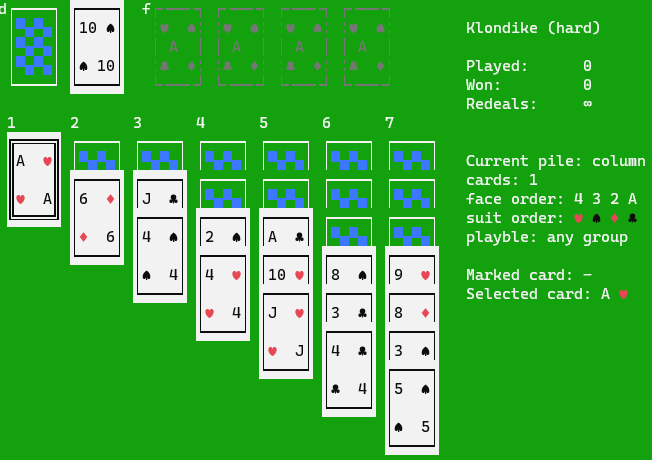

# Table of Contents

- [Intro](#intro)
    - [Look and feel](#look-and-feel)
- [Installation](#installation)
    - [Precompiled binaries](#precompiled-binaries)
    - [Portable mode](#portable-mode)
- [License](#license)
- [Credits](#credits)

[Documentation](/docs/usage.md)

## Intro

`SolKit` is a solitaire construction kit and a lot of playable solitaires out of the box.
You can create a new solitaire with your own rules and test it. 
If a new solitaire looks good to you, please, send me its rules(the file you passed to `solkit`) or open an PR and I'll include it into a new release.
The built-in set of rules is limited, but you can experiment with different rule combinations and modifications:

- mix of `Free cell` and `Klondike`, or `American Toad` and `Klondike`
- `Klondike` with fewer or greater number of columns
- `Klondike` with two decks and 4 foundations with ascending order starting from Ace, and other 4 foundations in descending order starting from King
- brand new solitaires, like included `Pile'em up`
- and many more another ways to have fun with solitaires.

### Look and feel

The application provides two themes. The dark one(default one) that looks like a regular terminal application with black background:


dark theme with four suit color enabled:


and Classic theme that looks like a table to play card games with green background:



The game is optimized for playing with keyboard, but mouse can be used as well(few terminals still do not support mouse, including new Windows Terminal, but it works in Windows `cmd.exe` terminal).
Keyboard and mouse controls are describes in details in [user's manual](/docs/usage.md#controls).

## Installation

The application can be compiled from source, or installed using cargo:

```shell
$ cargo install solkit
```

You need Rust compiler that supports Rust 2018 edition to do it. If you want to upgrade existing `SolKit`, execute the following command:

```shell
$ cargo install solkit --force
```

### Pre-compiled binaries

For Windows and Linux(musl-based build) you can download pre-compiled 64-bit binaries from [Release page](https://github.com/VladimirMarkelov/solkit/releases).

### Portable mode

By default, `solkit` saves all settings and statistics to user's configuration directory:

- Windows: `%APPDATA%\rionnag\solkit`
- Linux: `~/.config/rionnag/solkit`

If you create an empty file `config.toml`(or copy it from user's configuration directory) in the same directory where `solkit` executable binary is,
the application turns a portable one and since the next launch it will save its settings and your statistics local to the binary.

Note: if you played for a while and want to keep you statistics after making the application portable, do not forget to copy both files:

- `config.toml`: various application settings, including the last played solitaire
- `stats.toml`: detailed statistics for each played solitaire

## License

MIT or Apache 2.0

## Credits

Thank you all who play `Solkit` and send me new solitaires, report bugs, and propose new features.

Feel free to send bugs, suggestions, and pull requests.
