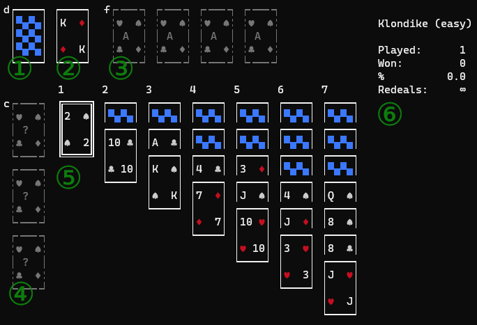

# Table of Contents

- [Layout and terminology](#layout-and-terminology)
    - [Information panel](#information-panel)
- [Command line options](#command-line-options)
    - [Arguments](#arguments)
    - [Custom rules](#custom-rules)
- [Portable mode](#portable-mode)
- [Controls](#controls)
    - [Keyboard](#keyboard)
    - [Mouse](#mouse)
- [Statistics](#statistics)
- [How to create your own solitaire](#how-to-create-your-own-solitaire)

## Layout and terminology

Play area for every solitaire may contain up to 5 areas: 2 mandatory (columns and foundations) and optional ones(deck, waste, and free cells).



1. `Deck` is in the left top corner(marked with character `d`). It is a pile of face-down cards that can be put to waste or to columns.
2. `Waste` is in the left top corner next to the right of the `deck`. It is a pile for cards dealt from the `deck`. If the `deck` is absent, dealt cards are put to columns.
3. `Foundation` is a one or more piles next to the right of the `deck` and `waste`(the first pile is marked with character `f`). The goal of every solitaire is to put all the cards to the foundation piles.
4. `Free cell` is a few piles(from 1 to 4) placed vertically at the left side  under the `deck`(the first pile is marked with character `c`). Every `free cell` is a pile where you can put a single card from any other pile temporarily. 
5. `Columns` is the rest of play area that the main part of every solitaire(from 1 to 10 piles). Arrange cards in piles here before moving them to foundations.
6. `Information panel` is a non-playable area at the right of the screen. Here the application displays current information about selected solitaire: solitaire name, times played and won, the number of redeals left.

Other terms:

- `Deal` is moving one or more cards(depending on a solitaire rules) from `deck` to `waste` or `columns`(in case of `waste` does not exist)
- `Redeal` is moving all cards from `waste` to `deck`

A solitaire is automatically marked as a `win` if only foundation piles contain cards.

### Information panel

Information panel comprises three sections: solitaire statistics, the current pile properties, and the selected and marked cards.

Solitaire statistics include how many time the solitaire has been played so far, the number of solved deals, and winning percentage.

The current pile properties explains in what order and which type of cards can be put on the current pile, and what cards are playable, i.e. which ones can be moved to another column. Face order of cards in the pile is one of:

- `A 2 3 4` - cards must be in ascending order
- `4 3 2 A` - cards must be in descending order
- `A 2 3 2` - cards must be either in ascending or descending order (alternate order)
- `-` - the pile does not have any order restrictions

Note that ascending and descending orders require the next card is higher or lower only by one point.
So, in case of ascending order, you can put `Q` on top of `J` but you cannot put `K` on `J`.
Another note: in all orders the values of card faces are looped, i.e., you can put `A` on top of `K` in ascending order, and `K` on top of `A` in descending order.

Suit order is one of:

- `♥ ♥ ♥ ♥` - put a card only of the same suit
- `♥ ♦ ♦ ♥` - put a card of the same color
- `♥ ♠ ♦ ♣` - put a card of an alternate color
- `-` - either no restriction(put a card of any suit), or is not applicable(e.g., deck or free cell pile)

The last section is selected and marked cards.
Most of the time, this information is redundant.
But in case of a pile grows too high and its top card gets invisible, this information may get handy.
`Marked card` is a card marked with `Space`. `Selected card` is a card under cursor.
If a card under cursor is a marked one, `[MARKED]` is displayed as well to indicate that selected and marked cards are the same one.

## Command line options

```
solkit [OPTIONS] [CUSTOM_RULES]
```

### Arguments

The application does not support reading settings from a configuration file. 
`Solkit` provides the following command line options to customize the look and feel:

- `-h` or `--help` displays the command line options and their descriptions
- `-v` or `--version` displays the application version
- `-t` or `--theme` selects a visual theme: `dark` or `classic`.
`dark` is the default one that uses standard terminal black color as the background color.
`classic` switches to classic card table colors: green background.

### Custom rules

Custom rules is a name of file from which `solkit` loads the custom solitaire rules.
After loading the rules, `solkit` test them for correctness. In case of error, the application exits and prints what was the issue.
If the rules seems fine, `solkit` starts in test mode: standard solitaries are disabled and statistics is not saved.
Use this mode to test a new solitaire before including it into the built-in list.

Note that custom rule can contain only one solitaire.

To see the rule file format and examples of a few solitaires, explore the directory with [examples](/sol_examples).
`annotated.sol` is an example of `Klondike (hard)` with detailed comments.

The file name with rules is arbitrary. While the example files use `.sol` extension, it can be any extension.

## Portable mode

By default, `solkit` saves all settings and statistics to user's configuration directory:

- Windows: `%APPDATA%\rionnag\solkit`
- Linux: `~/.config/rionnag/solkit`

If you create an empty file `config.toml`(or copy it from user's configuration directory) in the same directory where `solkit` executable binary is,
the application turns a portable one and since the next launch it will save its settings and your statistics local to the binary.

Note: if you played for a while and want to keep you statistics after making the application portable, do not forget to copy both files:

- `config.toml`: various application settings, including the last played solitaire
- `stats.toml`: detailed statistics for each played solitaire

## Controls

As a terminal application, `solkit` provides a bunch of hot keys for comfortable playing. Mouse is supported as well, though at basic level: only left and right clicks, no drag and drop.

### Keyboard

Cursor movement supports both standard arrow keys and Vi-like ones.

For all dialogs to select an item for a list (solitaire menu, end game menu):

- `Arrow up` and `k` to move the selection up
- `Arrow down` and `j` to move the selection down
- `Home` and `Shift+k` to select the first item
- `End` and `Shift+j` to select the last item
- `Page up` and `u` to move the selection up by a page
- `Page up` and `d` to move the selection down by a page
- `Escape` to close the selection dialog and return to the previous screen (in case of solitaire selection dialog, it exits the application)
- `Enter` to choose the selected item and close the dialog

When playing a solitaire:

- `F1` to show a help dialog with existing hot keys(excluding the obvious ones, like `Escape`)
- `Arrow left` and `l` to select the next pile
- `Arrow right` and `h` to select the previous pile
- `Arrow up` and `k` to select the faced-up card above in the selected pile if it is possible
- `Arrow down` and `j` to select the faced-up card below in the selected pile if it is possible
- `Escape` or `q` to display game menu (e.g., to restart or exit)
- `Ctrl+q` is a boss-key to close the application immediately. `Solkit` uses alternative screen to draw everything and on exit it restores the previous one, so after immediate exit, no one will see any `solkit` leftovers in the screen
- `1` through `0` to select a column with number from `1 `through `10`. If the column is already selected, the key works as `arrow up` 
- `Shift+1` through `Shift+0` to select a column with number from `1 `through `10`. If the column is already selected, the key works as `arrow down` 
- `d` to select the `deck`. If `deck` is already an active pile, it selects `waste` if it exists
- `f` to select the first pile in `foundation` area. If the current pile is a foundation, it select the next foundation pile - the move is looped, so after the last foundation pile it selects the first one
- `c` to select the first pile in `free cell` are. It works similar to `f` key
- `Space` to mark for moving or to clear mark if the current card is marked. This key is rarely needed in specific cases because of smart behavior of `Enter`(`m`) key
- `Enter` and `m` is a smart key that can do a few things depending on the previous actions(as you see, `m` can be used almost all the time instead of `Space`):
    * if no card is marked, it moves the selected card to the first(foundations piles have higher priority) pile allowed by the solitaire rules
    * if there is a marked card and it **is** the current card, it moves the marked card to the first(foundations piles have higher priority) pile allowed by the solitaire rules
    * if there is a marked card and it **is not** the current card, the application moves the marked card to the selected one if it allowed by solitaire rules
- `F5` and `Shift+r` to abandon the current solitaire and start a new one from scratch. If you have done at least one move, the number of played games increases, lowering your `win percentage`
- `u` to undo the last move
- `s` to highlight(to show hints) all the cards that can be moved to another pile. Note: in case of a solitaire uses `free cells` and any of them is empty, it highlights all bottom cards in all columns, making it a bit useless
- `Shift+s` to highlight(to show hints) all the cards where the selected card can be moved.

Note: cards highlighted with `s` and `Shift+s` are mutually exclusive. In other words, e.g., after pressing `Shift+s` all previously highlighted cards are cleared and new ones are highlighted.

### Mouse

Please note that some terminals do not support mouse actions in third-party applications.
E.g., "Windows Terminal" does not. So, in "Windows Terminal" mouse does not work, but the mouse works in old `cmd.exe` console.

Limited mouse support:

- `Left Click` works as `Space`
- `Right Click` works as `Enter`(`m`)

## Statistics

`Solkit` keeps solitaire statistics in a separate file `stats.toml` that is either in user's data directory (Windows: `%APPDATA%\rionnag\solkit`, Linux: `~/.config/solkit`)
or in the same directory where the executable binary is(in [portable mode](#portable-mode)).

Important notes: 

- starting a new solitaire does not affect the number attempts in statistics.
Until you move any card, you can exit an application or restart the solitaire without changing the solitaire's statistics.
- `solkit` does not load and saves statistics when you play a custom solitaire.
The application maintains statistics only for built-in solitaires.

## How to create your own solitaire

The built-in set of solitaires is not exhaustive, it can lack some great ones.
If you know a good solitaire that is unavailable in the game or you invent one, you can create a file with solitaire rules and play it.
To test, the new solitaire rules, pass the path to the file as an [argument to the application](#custom-rules).

There are types of solitaires that are impossible to implement with existing set of rules.
The current set of rules that can be customized:

- the number of cards: 52(one-deck game) or 104(two-deck game)
- the number of the `deck` redeals and how many cards to deal at a time in case of the `deck` pile exists
- the number of the `foundation` piles: from 1 through 8
- the number of the `columns`: from 1 through 10
- the number of the `free cells`: from 0 through 4
- availability of the `waste` pile
- the initial number of cards in every pile of the `column` area
- the initial card's face and suit for every `foundation` and `column` piles that determines what card can be put to the pile when it is empty
- face and suit orders of cards for every `foundation` and a global setting for all `column` piles
- what cards from the `columns` are playable (any that are face-up, only top ones, or only a sub-pile that has its cards in correct order)
- for `column` pile you can set `take-only` property to forbid putting cards to this column

Suit order can be:

- same suit - you can put a card to a pile only if its top card suit equal the card suit
- same color - you can put spades and clubs together, or diamonds and hearts together
- alternate color - you can put "red" suits(diamonds and hearts) on "black" ones(clubs and spades) and vice versa

Face order one of:

- ascending - A, 2, 3, ..., Q, K, A, 2, ...
- descending - K, Q,..., 2, A, K, Q, ...
- any - the new card must be either a point higher or a point lower than the top pile's card, e.g., A, 2, 3, 2, A, K, A,...

Initial card's face for an empty column:

- an explicit card face (A..K)
- any - an arbitrary card can start the pile
- none - if the pile gets empty, the pile cannot be refilled

For card faces the valid values are `A, 2, 3, 4, 5, 6, 7, 8, 9, 10, J, Q, K, any, none`. 
`Any` is usually used to allow any card to start a pile when it gets empty.
`None` indicated that if a pile gets empty, it cannot be refilled.

For suits values are `spade`, `club`, `diamond`, `heart`, and `any`.
The last value is used to allow a card of any suit to start the pile if it is empty.

### Rule file format

A file with a solitaire rules is a UTF8-encoded plain-text file that resembles a TOML or a Windows-INI configuration file.
Empty lines and comments(lines starting with `#` character) are ignored.
All names and values are case-insensitive.

The file contains up to 5 sections: 3 mandatory(`global`, `foundation`, and `play`) and 2 optional(`deck` and `temp`).
Every subsection shows the example from `Klondike (easy)`.

#### Global options

The sections starts with `[global]` line. It must contain two items:

| Name | Definition | Values |
| --- | --- | --- |
| `name` | A unique solitaire name. It is displayed at the right of the screen when playing a solitaire | `n/a` |
| `decks` | The number of card decks | `1` or `2` |

Klondike section:

```
[global]
name = Klondike (easy)
decks = 1
```

#### Deck and waste options

The section starts with `[deck]`. Items are optional if a solitaire does not use it, e.g.,
if a solitaire does not have `waste`, `redeals` and `deal_by` are unused. Values as follows:

| Name |  Definition | Values |
| --- |  --- | --- |
| `redeals` |  The number of redeals | any number; `unlimted` or negative number means unlimited redeals |
| `deal_by` |  The number of cards moved from `deck` to `waste` at a time | from `1` to `16` |
| `deal_to` |  Where cards move from `deck` | `waste` or `columns` |

Klondike section:

```
[deck]
redeals = unlimited
deal_by = 1
deal_to = waste
```

#### Foundation options

The section starts with `[foundation]`. The section defines properties of every foundation pile.
The number of items equal the number of foundation piles: from `1` to `8` items.
Every item starts with `column =` and has the same format:

```
column = FirstFace, FirstSuit, FaceOrder, SuitOrder
```

| Property |  Definition | Values |
| --- |  --- | --- |
| `FirstFace` | The face of the card that must be put first to the pile | `A,2,...,Q,K,any` |
| `FirstSuit` | The suit of the card that must be put first to the pile | `spade,club,diamond,heart` |
| `FaceOrder` | In what face order cards must be put to the pile | `ascending,descending,any` or `asc,desc,any` |
| `SuitOrder` | In what suit order cards must be put to the pile | `same suit,same color,alternate color` |

Klondike section:

```
[foundation]
column = A, any, ascending, same suit
column = A, any, ascending, same suit
column = A, any, ascending, same suit
column = A, any, ascending, same suit
```

#### Column options

The section starts with `[column]`. The section defines properties of every pile in columns area.
It contains a few global options that are the same for all piles and a few per-column attributes.
The maximal number of declared columns in the section is 10.

Global options:

| Property | Definition | Values |
| --- | --- | --- |
| `playable_card` | How many cards and which ones can be moved to another column at a time | `top` - only the top card, `any` - any number of face-up cards, `ordered` - any number of face-up cards if their order follows the column sort order |
| `refill` | Face of a card that can start the pile if it is empty | `A,2,...,K,any,none`. `none` means that the column cannot be refilled after it gets empty |
| `order` | A pair of comma-separated values: the first is face order, the second one is suit order | see `FaceOrder`, `SuitOrder` for details |

Per-column options are the list of lines starting with `column =`. The number of such lines equal the number of columns in column area.
Every column state has up to 3 values (the first and the second values are mandatory): 

```
column = NumCards, NumFaceUpCards, TakeOnly
```

Per-column attributes:

| Attribute | Definition | Values |
| --- | --- | --- |
| `NumCards` | The total number of cards in the column at the start | Any number from `0` to the deck size |
| `numFaceUpCards` | The number of cards in the column that are face-up | `0` if the column is empty, from `1` to `NumCards` if not |
| `TakeOnly` | If the column has this attribute, it is impossible to put cards to the column and only its top card is playable |

Klondike section:

```
[column]
playable_card = any
refill = K
order = descending, alternate color
column = 1, 1
column = 2, 1
column = 3, 1
column = 4, 1
column = 5, 1
column = 6, 1
column = 7, 1
```

#### Free cells options

The section starts with `[temp]`. The section contains only one option:

| Property | Definition | Values |
| --- | --- | --- |
| `slots` | The number of available free cells | from `0` to `4` |

Klondike section: the solitaire does not have this section.
